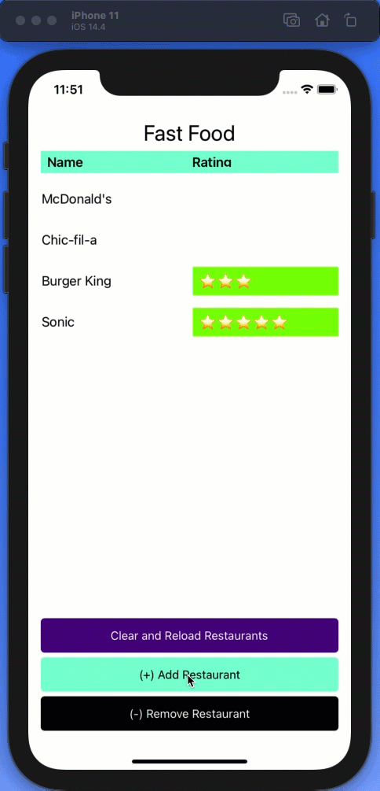
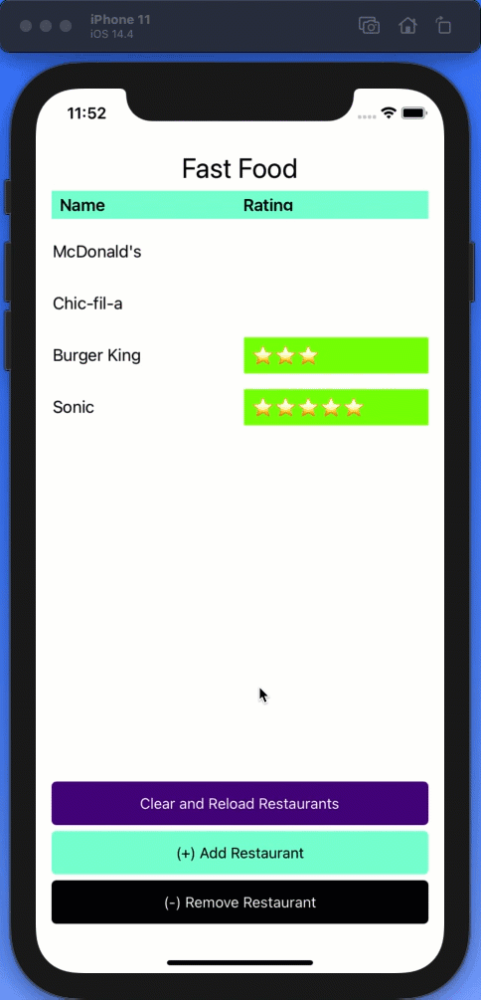

# Xamarin.Forms CollectionView Refresh Glitch (iOS)

This repo includes a small reproducible example of a Xamarin.Forms `CollectionView` animation glitch. The glitch occurs when an entire `CollectionView`—backed by an `ObservableCollection`—is cleared and then reloaded multiple times. The glitch occurs in iOS but not in Android.

I am posting this in the hope that the Xamarin.Forms team will be able to replicate and fix the issue. While there are [workarounds](#workaround), I feel that this is a core issue that should be solved at the root.


The glitch is a related to a label in the `CollectionView` with a visibility toggle (`IsVisible`):

```c#
<Label
  ...
  IsVisible="{Binding StarsAreVisible}" />
```

Items in the `CollectionView` that are deemed invisible still flash for a split second showing a blank green background.

## Additional Working Scenarios

The glitch does not appear when:

Items are added to the CollectionView:



Items are removed from the CollectionView:


When the CollectionView is refreshed once:



## Workaround

You can workaround this issue by adding a delay. But in a large scale production app I am working on this solution is not feasible because of our Model View View Model (MVVM) architecture.

```c#
private async void ClearAndReloadRestaurants(object sender, EventArgs e)
{
    Restaurants.Clear();

    // This fixes the animation problem but may not scale in a larger app
    await Task.Delay(100);

    RefreshRestaurants();
}
```


